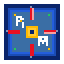

<div align="center">

# 🗺️ RetroMap

**A retro Windows XP-styled social media platform with a top-down 2D sandbox world**

*Where nostalgia meets creativity — powered by vanilla JavaScript*



[Features](#-features) • [Screenshots](#-screenshots) • [Getting Started](#-getting-started) • [Architecture](#-architecture) • [Roadmap](#-roadmap)

</div>

---

## 📖 Overview

**RetroMap** is a single-page web application that recreates the Windows XP desktop experience inside your browser, combining it with modern social media features and a Stardew Valley / Manyland-inspired top-down sandbox world.

Users can create profiles, share posts, chat with friends, explore a persistent pixel-art world, build structures, and create their own pixel art objects — all inside a lovingly recreated Windows XP desktop environment.

| Pillar | Description |
|--------|-------------|
| 🪟 **Windows XP Shell** | Full desktop: taskbar, start menu, draggable windows, minimize/maximize/close |
| 💬 **Social Media** | Profiles, posts, likes, comments, friend system, real-time chat |
| 🎮 **Top-Down Sandbox World** | Persistent 2D world with building, exploration, pixel-art creation tools |
| 🎨 **Pixel Art Assets** | Custom pixel-art icons, logos, and UI elements generated with AI skills |

---

## ✨ Features

### 🪟 Windows XP Desktop Shell
- **Authentic Luna theme** — Blue, Silver, and Olive color schemes with CSS custom properties
- **Window Manager** — Drag, resize, minimize, maximize, and close windows with classic XP title bar + Webdings buttons
- **Taskbar** — Start button, window items for open apps, system tray with live clock
- **Start Menu** — Classic sidebar layout with application shortcuts and branding
- **Desktop Icons** — Double-click to launch apps, single-click to select

### 👤 User Profile
- **Account system** — Register and login with localStorage persistence
- **Profile banner** — Avatar, display name, @username, online status
- **Editable bio** — Inline editing with save/cancel
- **Game Stats** — High score, coins collected, items created, play time
- **Settings** — Theme switcher (Blue/Silver/Olive), sound toggle, sign out

### 🎨 Design System
- **Windows XP Luna** color tokens with full CSS custom property support
- **3D border effects** — Classic raised/sunken button and window styling
- **Tahoma typography** — Authentic XP font family throughout
- **Custom scrollbars** — XP-style 16px scrollbars with 3D thumb and buttons
- **Pixel-art icons** — Hand-crafted SVG pixel art for all desktop icons and branding

### 🔮 Coming Soon
- Social feed with posts, likes, and comments
- Real-time chat with friends
- Friends list with search and requests
- Top-down sandbox world (Phaser.js)
- Pixel art creation editor (Manyland-style)
- Building system with grid-snapping
- Inventory, tools, NPCs, and more

---

## 📸 Screenshots

> *Screenshots coming soon! Add your own by taking captures of the app running in the browser.*

| View | Description |
|------|-------------|
| **Login Window** | RetroMap login/register form over the XP desktop |
| **Desktop** | Full desktop with icons, taskbar, and Start menu |
| **Profile App** | User profile with banner, bio, stats, and settings |
| **Start Menu** | Classic sidebar start menu with app shortcuts |

---

## 🚀 Getting Started

### Prerequisites

- A modern web browser (Chrome, Firefox, Edge, or Safari)
- No build tools or servers required — **just open the HTML file**

### Running Locally

```bash
# Clone the repository
git clone https://github.com/YOUR_USERNAME/retromap.git

# Navigate to the project
cd retromap

# Open in browser (choose one):
# macOS
open index.html

# Windows
start index.html

# Linux
xdg-open index.html

# Or just double-click index.html in your file explorer
```

No web server, npm install, or build step required. Everything runs directly in the browser using localStorage for data persistence.

> **Note:** For best results, use **Google Chrome** or **Microsoft Edge**. 

---

## 🏗️ Architecture

### Tech Stack

| Technology | Purpose |
|------------|---------|
| **HTML5 / CSS3** | Structure and styling (vanilla, no frameworks) |
| **JavaScript (ES6+)** | Application logic, window management, dynamic UI |
| **Phaser.js 3** (planned) | 2D sandbox game engine |
| **LocalStorage** | Client-side data persistence |

### Project Structure

```
retromap/
├── index.html                  # Main entry point (just open this!)
├── ARCHITECTURE.md             # Detailed architecture documentation
├── DESIGN.md                   # Full design system documentation
├── README.md                   # This file
│
├── assets/
│   └── ui/
│       ├── icons/              # SVG pixel-art icons (8 files)
│       └── logos/              # RetroMap brand logo
│
├── src/
│   ├── main.js                 # Application entry point & app registry
│   ├── shell/                  # Windows XP desktop shell
│   │   ├── WindowManager.js    # Window lifecycle & z-index management
│   │   ├── Window.js           # Draggable window with XP chrome
│   │   ├── Desktop.js          # Desktop icons & wallpaper
│   │   ├── Taskbar.js          # Bottom taskbar with clock
│   │   └── StartMenu.js        # Classic start menu
│   ├── apps/                   # Applications
│   │   ├── login/              # Login & registration
│   │   └── profile/            # User profile & settings
│   ├── components/             # Reusable UI components
│   │   ├── Button.js           # XP 3D buttons
│   │   ├── Input.js            # XP sunken input fields
│   │   ├── Dialog.js           # Modal dialogs (alert/confirm/prompt)
│   │   └── ProgressBar.js      # Animated XP progress bar
│   ├── services/
│   │   └── StorageService.js   # Centralized localStorage access
│   └── utils/
│       ├── helpers.js          # DOM helpers, ID gen, events
│       ├── dateFormatter.js    # Clock, relative time formatting
│       └── soundManager.js     # Audio playback (prepared for XP sounds)
│
├── styles/
│   ├── xp-theme.css            # Theme variables (Blue/Silver/Olive)
│   ├── main.css                # Desktop, taskbar, start menu layout
│   ├── components.css          # Window, button, input, dialog styles
│   └── apps/
│       ├── login.css           # Login form styles
│       └── profile.css         # Profile page styles
│
└── design-system/              # (Planned) Generated design tokens
```

### Key Design Decisions

| Decision | Choice | Rationale |
|----------|--------|-----------|
| **Framework** | Vanilla JS | Lightweight; XP aesthetic pairs better with direct DOM control |
| **Game Engine** | Phaser.js 3 (planned) | Best browser-based 2D engine for the sandbox world |
| **Data Storage** | LocalStorage | No backend needed for MVP; easy to upgrade later |
| **CSS Approach** | CSS custom properties | Theme switching via variables; no framework lock-in |

---

## 🗺️ Roadmap

### ✅ Phase 1 — Foundation (Complete)
- [x] Project scaffolding & file structure
- [x] Windows XP CSS theme (Blue/Silver/Olive)
- [x] Window Manager: open, close, drag, minimize, maximize
- [x] Taskbar with Start menu and clock
- [x] Desktop with clickable pixel-art icons
- [x] Login / Registration app
- [x] User profile with bio editing, stats, and settings

### 🔄 Phase 2 — Social Features (In Progress)
- [ ] Social feed (create posts, like, comment)
- [ ] Friends system (add, accept, list)
- [ ] Notification system (XP-style toast balloons)
- [ ] Post sharing from game

### 📋 Phase 3 — Real-time Chat
- [ ] Chat app with conversation list
- [ ] Message sending and receiving
- [ ] Online/offline status indicators

### 📋 Phase 4 — Top-Down Sandbox World
- [ ] Phaser.js game engine setup
- [ ] Top-down tilemap rendering
- [ ] 4-direction player movement
- [ ] World chunk system
- [ ] Building system
- [ ] Manyland-style creation editor
- [ ] Inventory & tools
- [ ] NPCs and interactions

### 📋 Phase 5 — Assets & Polish
- [ ] Pixel art sprites generation
- [ ] Sound effects and music
- [ ] Performance optimization
- [ ] PWA support

---

## 🛠️ Built With

- **Vanilla JavaScript** — No frameworks, no dependencies
- **CSS Custom Properties** — For theme switching and design tokens
- **SVG** — For pixel-art icons and logos
- **localStorage** — For client-side data persistence
- **Phaser.js 3** (planned) — For the 2D sandbox game engine

### Development Skills (via Codebuff CLI)
- `pixel-art-sprites` — Pixel art sprite generation
- `logo-generator` — Logo and brand asset creation
- `ui-ux-pro-max` — Design system intelligence
- `fal-generate` — AI image generation for assets

---

## 📚 Documentation

- **[ARCHITECTURE.md](ARCHITECTURE.md)** — Full system architecture, data models, and implementation plan
- **[DESIGN.md](DESIGN.md)** — Complete design system with colors, typography, components, and accessibility

---

## 🤝 Contributing

This is a personal project, but suggestions and ideas are welcome! Feel free to open issues or reach out.

---

<div align="center">

**RetroMap** — Built with ❤️ and nostalgia for Windows XP

[⬆ Back to top](#-retromap)

</div>
